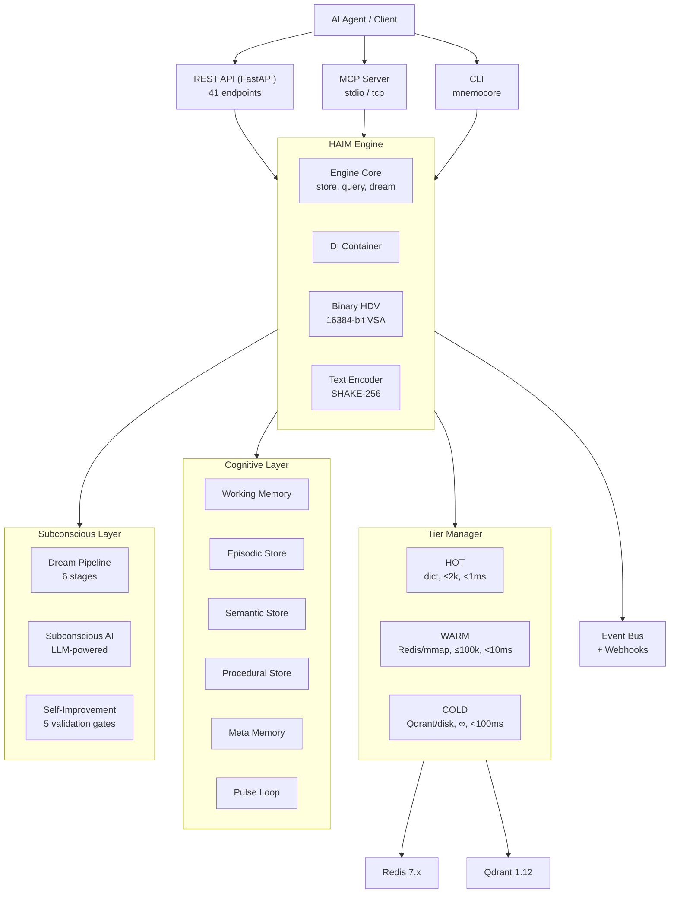
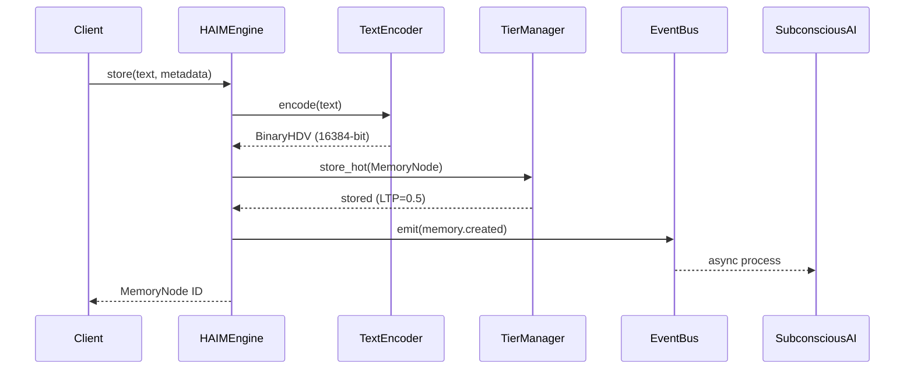
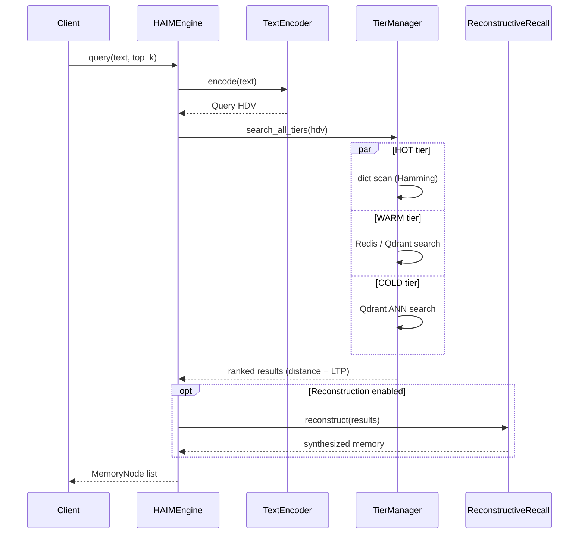
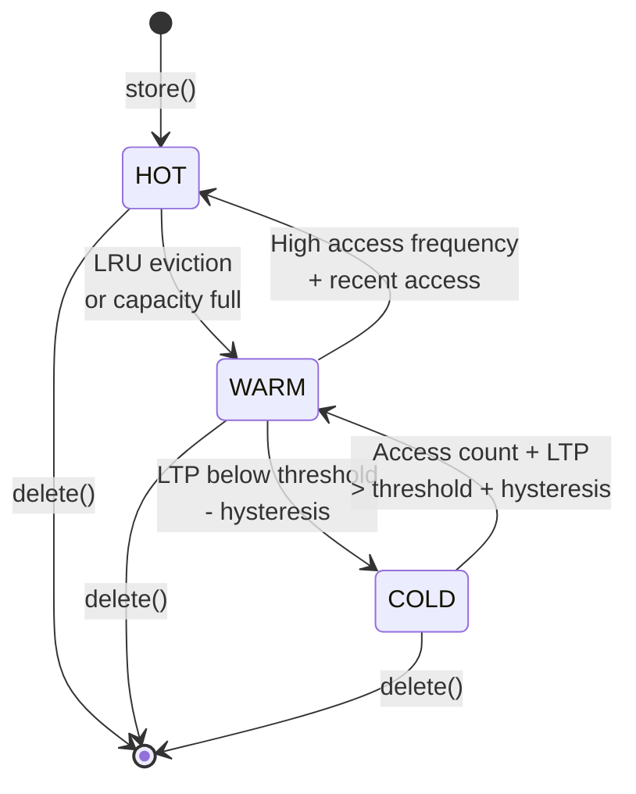

# MnemoCore Architecture — v2.0.0

## Overview

MnemoCore is a cognitive memory infrastructure built on Binary Hyperdimensional Computing (HDC/VSA). It provides AI agents with persistent, self-organizing memory that consolidates, decays, and reasons — not just stores and retrieves.

### Documentation Map

| Document | Description |
|----------|-------------|
| [API.md](API.md) | Complete REST API reference (41 endpoints) |
| [CLI.md](CLI.md) | Command-line interface reference |
| [CONFIGURATION.md](CONFIGURATION.md) | All configuration options |
| [DEPLOYMENT.md](DEPLOYMENT.md) | Docker, Compose, and Kubernetes deployment |
| [EVENTS.md](EVENTS.md) | Event system and webhook delivery |
| [FORGETTING.md](FORGETTING.md) | SM-2 spaced repetition and decay system |
| [LLM_INTEGRATION.md](LLM_INTEGRATION.md) | LLM provider integration |
| [GLOSSARY.md](GLOSSARY.md) | Terms and abbreviations |
| [SUBCONSCIOUS_AI.md](SUBCONSCIOUS_AI.md) | Subconscious worker setup |
| [RECONSTRUCTIVE_MEMORY.md](RECONSTRUCTIVE_MEMORY.md) | Reconstructive recall module |
| [EMBEDDING_REGISTRY.md](EMBEDDING_REGISTRY.md) | Embedding model versioning |
| [SELF_IMPROVEMENT_DEEP_DIVE.md](SELF_IMPROVEMENT_DEEP_DIVE.md) | Self-improvement loop design |

---

## System Architecture (High-Level)



### Detailed ASCII Layout

```
+----------------------------------------------------------------------+
|                           REST API (FastAPI)                         |
|  /store  /query  /feedback  /insights/gaps  /stats  /health         |
|  Rate Limiting - API Key Auth - Prometheus /metrics                  |
+--------------------------|-------------------------------------------+
                           |
+--------------------------v-------------------------------------------+
|                         HAIM Engine                                   |
|  engine.py + engine_core.py + engine_lifecycle.py (3 mixins)         |
|  Central cognitive coordinator - store, query, dream, feedback       |
+----------------------------------------------------------------------+
|                                                                      |
|  +------------------------------------------------------------+     |
|  |                    DI Container (container.py)              |     |
|  |  Wires all services via frozen config -> engine constructor|     |
|  +------------------------------------------------------------+     |
|                                                                      |
|  +--------------------+  +--------------------+                     |
|  |   Binary HDV Core  |  |   Text Encoder     |                     |
|  |   16384-bit VSA    |  |   Token->HDV via   |                     |
|  |   XOR - Bundle -   |  |   SHAKE-256 seed + |                     |
|  |   Permute - Hamming|  |   positional bind  |                     |
|  +--------------------+  +--------------------+                     |
|                                                                      |
|  +--------------------------------------------------------------+   |
|  |                   Tier Manager                                |   |
|  |   HOT (dict, <=2k, <1ms)                                     |   |
|  |   WARM (Redis/mmap, <=100k, <10ms)                          |   |
|  |   COLD (Qdrant/disk, infinite, <100ms)                      |   |
|  |   LTP-driven eviction - hysteresis - auto-promotion         |   |
|  +--------------------------------------------------------------+   |
|                                                                      |
|  +------------ Phase 4 Cognitive Layer ------------------------+     |
|  |  Bayesian LTP - Semantic Consolidation - Gap Detection      |     |
|  |  Immunology (attractor cleanup) - XOR Attention Masking    |     |
|  |  Episodic Chaining - Synapse Index - HNSW Index            |     |
|  |  Recursive Synthesizer - Ripple Context - Batch Ops        |     |
|  +--------------------------------------------------------------+     |
|                                                                      |
|  +------------ Phase 5 Cognitive Services ---------------------+     |
|  |  WorkingMemory      - active slot buffer (7+/-2 items, TTL)|     |
|  |  EpisodicStore      - temporal chains, LTP, chain repair   |     |
|  |  SemanticStore      - Qdrant concepts, CLS consolidation   |     |
|  |  ProceduralStore    - skill library, word-overlap matching |     |
|  |  MetaMemory         - anomaly detection, LLM proposals     |     |
|  |  SelfImprovement    - dry-run Phase 0, 5 validation gates  |     |
|  +--------------------------------------------------------------+     |
|                                                                      |
|  +------------ Phase 6 Research Services ----------------------+     |
|  |  StrategyBank       - 5-phase strategy loop, Bayesian conf.|     |
|  |  KnowledgeGraph     - spreading activation, community det. |     |
|  |  MemoryScheduler    - priority queue, interrupts, load shed|     |
|  |  SAMEP (Exchange)   - multi-agent memory sharing, HMAC    |     |
|  +--------------------------------------------------------------+     |
|                                                                      |
|  +------------ Phase 7+ Advanced Cognitive --------------------+     |
|  |  ReconstructiveRecall - HDV-based memory reconstruction    |     |
|  |  ContextOptimizer      - Token-aware context prioritization|     |
|  |  FutureThinking (EFT)  - Episode simulation, planning      |     |
|  |  AssociationNetwork    - Graph-based associations          |     |
|  |  ForgettingAnalytics   - SM-2 spaced repetition dashboard  |     |
|  +--------------------------------------------------------------+     |
|                                                                      |
|  +------------ Pulse Loop (Cognitive Heartbeat) ---------------+    |
|  |  Tick 1:  WM Maintenance         Tick  7: Meta Reflection  |    |
|  |  Tick 2:  Episodic Chaining      Tick  8: Strategy Refine  |    |
|  |  Tick 3:  Semantic Refresh       Tick  9: Graph Maintenance|    |
|  |  Tick 4:  Gap Detection          Tick 10: Scheduler Tick   |    |
|  |  Tick 5:  Insight Generation     Tick 11: Exchange Sync    |    |
|  |  Tick 6:  Procedure Refinement                              |    |
|  +--------------------------------------------------------------+     |
|                                                                      |
|  +------------ Dream Pipeline (Phase 6) -----------------------+    |
|  |  EpisodicClusterer   - Groups memories by time proximity   |    |
|  |  PatternExtractor    - Identifies recurring patterns       |    |
|  |  DreamSynthesizer    - Builds higher-level abstractions    |    |
|  |  ContradictionResolver - Detects and resolves conflicts    |    |
|  |  SemanticPromoter    - Promotes important memories         |    |
|  |  DreamReportGenerator - Creates consolidation reports      |    |
|  +--------------------------------------------------------------+     |
|                                                                      |
|  +------------ Subconscious Layer -----------------------------+     |
|  |  SubconsciousAI     - LLM dream synthesis (multi-provider) |     |
|  |  SubconsciousDaemon - background asyncio orchestrator      |     |
|  |  ConsolidationWorker - nightly merge + prune               |     |
|  |  SelfImprovementWorker - autonomous memory refinement (P0) |     |
|  +--------------------------------------------------------------+     |
|                                                                      |
|  +------------ Meta Layer -------------------------------------+      |
|  |  GoalTree           - hierarchical task tracking           |      |
|  |  LearningJournal    - persistent learning log              |      |
|  +--------------------------------------------------------------+     |
|                                                                      |
+----------------------------------------------------------------------+
```

---

## Data Flow

### Memory Storage Flow



<details><summary>ASCII version</summary>

```
User Input -> TextEncoder.encode() -> BinaryHDV
    -> HAIMEngine.store()
        -> TierManager.store_hot() (initial placement)
        -> MemoryNode created with LTP=0.5
        -> Event emitted: memory.created
        -> Background: SubconsciousAI may process
```
</details>

### Memory Query Flow



<details><summary>ASCII version</summary>

```
Query Text -> TextEncoder.encode() -> Query HDV
    -> HAIMEngine.query()
        -> TierManager.search_all_tiers()
            -> HOT: dict scan (Hamming distance)
            -> WARM: Redis/Qdrant vector search
            -> COLD: Qdrant ANN search
        -> Results ranked by distance + LTP
        -> Optional: ReconstructiveRecall for synthesis
    -> Return ranked MemoryNode list
```
</details>

### Dream Pipeline Flow

```mermaid
flowchart LR
    Idle["Idle Detected"] --> Sched["DreamScheduler"]
    Sched --> S1["1. EpisodicClusterer<br/>Group by time"]
    S1 --> S2["2. PatternExtractor<br/>Find patterns"]
    S2 --> S3["3. DreamSynthesizer<br/>Create abstractions"]
    S3 --> S4["4. ContradictionResolver<br/>Fix conflicts"]
    S4 --> S5["5. SemanticPromoter<br/>Promote to WARM"]
    S5 --> S6["6. ReportGenerator<br/>Output report"]
    S6 --> Done["Events emitted<br/>Report persisted"]
```



<details><summary>ASCII version</summary>

```
Idle Detected -> DreamScheduler.trigger_dream()
    -> DreamPipeline.run()
        -> Stage 1: EpisodicClusterer (group by time)
        -> Stage 2: PatternExtractor (find patterns)
        -> Stage 3: DreamSynthesizer (create abstractions)
        -> Stage 4: ContradictionResolver (fix conflicts)
        -> Stage 5: SemanticPromoter (promote to WARM)
        -> Stage 6: DreamReportGenerator (output report)
    -> Results persisted, events emitted
```
</details>

### Tier Transition Flow



---

## Key Files

| Component | Path | Purpose |
|-----------|------|---------|
| **Engine** | `src/mnemocore/core/engine.py` | Central coordinator (3 mixins) |
| **Container** | `src/mnemocore/core/container.py` | DI wiring for all services |
| **Config** | `src/mnemocore/core/config.py` | 41 frozen dataclasses, YAML loader |
| **BinaryHDV** | `src/mnemocore/core/binary_hdv.py` | 16384-dim binary vector math |
| **TierManager** | `src/mnemocore/core/tier_manager.py` | HOT/WARM/COLD orchestration |
| **Pulse** | `src/mnemocore/core/pulse.py` | 11-phase cognitive heartbeat |
| **StrategyBank** | `src/mnemocore/core/strategy_bank.py` | Strategy distillation loop |
| **KnowledgeGraph** | `src/mnemocore/core/knowledge_graph.py` | Semantic graph + activation |
| **MemoryScheduler** | `src/mnemocore/core/memory_scheduler.py` | Priority job scheduler |
| **SAMEP** | `src/mnemocore/core/memory_exchange.py` | Multi-agent memory exchange |
| **WorkingMemory** | `src/mnemocore/core/working_memory.py` | Active slot buffer |
| **EpisodicStore** | `src/mnemocore/core/episodic_store.py` | Temporal episode chains |
| **SemanticStore** | `src/mnemocore/core/semantic_store.py` | Qdrant concept persistence |
| **ProceduralStore** | `src/mnemocore/core/procedural_store.py` | Skill library |
| **MetaMemory** | `src/mnemocore/core/meta_memory.py` | Anomaly detection |
| **DreamPipeline** | `src/mnemocore/subconscious/dream/` | Multi-stage consolidation |
| **ReconstructiveRecall** | `src/mnemocore/cognitive/memory_reconstructor.py` | Memory synthesis |
| **ContextOptimizer** | `src/mnemocore/cognitive/context_optimizer.py` | Token-aware prioritization |
| **FutureThinking** | `src/mnemocore/cognitive/future_thinking.py` | Episode simulation |
| **ForgettingManager** | `src/mnemocore/core/forgetting/` | SM-2 spaced repetition |
| **API** | `src/mnemocore/api/main.py` | FastAPI REST interface |
| **MCP Server** | `src/mnemocore/mcp/server.py` | MCP protocol adapter |
| **LLM Integration** | `src/mnemocore/llm/` | Multi-provider LLM support |

---

## Tier System Details

### HOT Tier
- **Storage**: In-memory Python dict
- **Capacity**: 2,000 memories (configurable via `hot_tier_max`)
- **Latency**: <1ms access
- **Eviction**: LRU/LFU to WARM when full
- **Use Case**: Active working memories, recent accesses

### WARM Tier
- **Storage**: Redis or memory-mapped files
- **Capacity**: ~100,000 memories
- **Latency**: <10ms access
- **Backend**: Configurable (mmap or Qdrant)
- **Use Case**: Medium-term storage, frequent access patterns

### COLD Tier
- **Storage**: Qdrant vector DB or filesystem
- **Capacity**: Unlimited
- **Latency**: <100ms access
- **Compression**: gzip (filesystem mode)
- **Use Case**: Long-term archive, rare access

### Tier Transitions
- **Promotion**: Access count + LTP exceeds threshold + hysteresis delta
- **Demotion**: LTP below threshold - hysteresis delta
- **Hysteresis**: Prevents thrashing at tier boundaries

---

## MCP Integration

The Model Context Protocol (MCP) server enables AI agents to interact with MnemoCore:

```
AI Agent (MCP Client) <-> MnemoCore MCP Server <-> HAIM Engine
```

### Available Tools
- `memory_store`: Store new memories with metadata
- `memory_query`: Semantic search across all tiers
- `memory_get`: Retrieve specific memory by ID
- `memory_delete`: Remove memories
- `memory_stats`: System statistics
- `memory_health`: Health check

### Transport Modes
- **stdio**: Recommended for local clients (Claude Desktop, etc.)
- **tcp**: For remote access (configurable host/port)

---

## Configuration

All configuration lives in `config.yaml` and is loaded into a hierarchy of frozen dataclasses by `load_config()`. The 41 config classes are organized into 9 sections:

1. **Section 1 Infrastructure** - Redis, Qdrant, paths, performance
2. **Section 2 API & Security** - CORS, rate limits, API keys
3. **Section 3 Encoding & Core** - HDV dimensions, LTP params, tiering
4. **Section 4 Subconscious** - Dream worker, consolidation, self-improvement
5. **Section 5 Performance** - Batch sizes, concurrency, HNSW
6. **Section 6 Cognitive** - WM, episodic, semantic, procedural, meta
7. **Section 7 Extensions** - StrategyBank, KnowledgeGraph, MemoryScheduler, SAMEP
8. **Section 8 Root Composite** - `HAIMConfig` aggregating all sections
9. **Section 9 Loader** - YAML parsing + environment variable overrides

Sensitive values (API keys, passwords) are always read from environment variables, never stored in YAML.

See `docs/CONFIGURATION.md` for complete reference.

---

## Testing

- **2,200+ tests** across unit, integration, and regression suites
- `pytest` with `asyncio_mode=auto` for async test support
- Key test files: `test_cognitive_services.py` (65), `test_self_improvement_worker.py` (60+), `test_pulse_phases.py` (50+), `test_store_integration.py` (25+), `test_phase6_*.py` (85)

---

## Observability

- Prometheus metrics at `/metrics`
- Grafana dashboard: `grafana-dashboard.json`
- Structured logging via `loguru` (services) and stdlib `logging` (pulse/API)
- Per-phase timing in pulse loop stats
- Dream pipeline reports in `data/dream_reports/`

---

*Architecture document maintained alongside code. See `CHANGELOG.md` for version history.*
